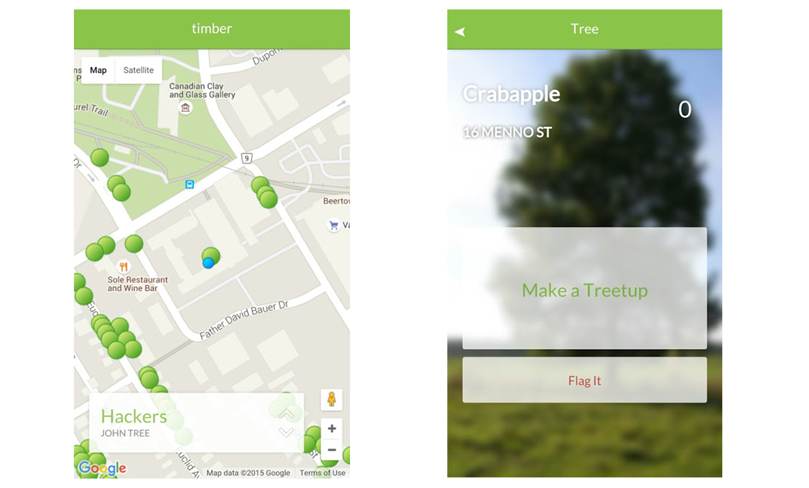

# 

*First place finisher at Waterloo CodeFest 2015*

Timber is an app that crowdsources city inspection data in a social fashion. By utilizing open city data, the app maps all the trees in the Waterloo Region, providing a user-friendly graphical representation of the open database. The social aspect of the app is the ability to create Treetups, or meetups at a tree, a fun lighthearted way to keep user engagement. The app also allows for easy reporting of trees that are diseased, in need of trimming or obstructing a path through an integrated "Report" button that automatically notifies city officials. Infact, since the app is geolocation based and crowdsourced, this makes it harder to abuse reporting as one has to be at the tree to be able to open up the tree details page and consequently be able to report it.

Explaining the screenshots, the blue dot is you, and it moves around on the map based on your current position.

The green dots are trees in the database (the Waterloo data set that we used had ~90000 of them).

The dialogue in the bottom that reads "Hackers / John Tree" pops up when you're within 10m of a tree. Obviously, this is a fake tree that we used for testing purposes, but the real tree dialogues read: "Species / Address". On this dialogue, there are upvote and downvote buttons that you can press to either vote up or vote down the tree, increasing or decreasing its score.

*You can read more about it at the following sites:*

[CBC: App that maps all 30,000 City of Waterloo trees wins open data hackathon](http://www.cbc.ca/news/canada/kitchener-waterloo/timber-waterloo-open-data-hackathon-winner-maps-30000-city-trees-1.3290541)

[SAP: The Genius of Youth](http://scn.sap.com/community/business-trends/blog/2015/10/29/the-genius-of-youth)

[Exchange: City of Waterloo Codefest a hit for the community](http://www.exchangemagazine.com/morningpost/2015/week43/Thursday/15102907.htm)

[570News: Tree-mapping app wins Waterloo Codefest](http://www.570news.com/2015/10/28/tree-mapping-app-wins-waterloo-codefest/)

[SAP: SAP Yells Timber in Waterloo](https://scn.sap.com/blogs/RebelHR/2015/10/30/sap-yells-timber-in-waterloo)

## Install

The FireBase backend was custom set up with the Open Tree Data preprocessed. Installing the app requires the Intel XDK IDE which packages the mobile site into an Apache Cordova runtime that can run on any mobile platform, from iOS to Android, BlackBerry, Windows Phone, etc.

## Next Steps

This app could be used for theoretically any municipally managed resource. Trees are a great one, but let's say that you want an app where users can rate public washrooms for cleanliness, or report graffiti on buildings. The code we wrote for timber could just as easily be applied to any of these things. And that's where we go from here, making municipally managed data easily accessible to users, and making the feedback from users easily accessible to the city.

## License

MIT © [George Utsin](http://georgeutsin.com)
[John Fish](http://www.johnafish.ca/)
and Alex Foley

